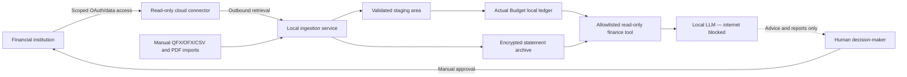

# How I Would Build the Mac Mini Financial OS

**Document type:** Architecture, security, and implementation handoff  
**Prepared:** August 12, 2026  
**Status:** Banking decisions are complete; Financial OS implementation has not started  
**Owner:** Yemane

## 1. Vision

Build a private, locally operated Personal Financial Copilot and Financial Operating System on a Mac Mini.

The system should automatically collect authorized financial data, organize it into a dependable local ledger, preserve official statements, and allow a locally hosted LLM to answer financial questions. The LLM must not send financial information to an external AI provider and must not be capable of moving money.

The goal is not merely a budgeting application. The goal is a durable personal financial information system that can support:

- Personal cash-flow management
- Payroll and recurring-income analysis
- Rental-property income and expense tracking
- Transaction search and categorization
- Statement reconciliation
- Bill and recurring-payment monitoring
- Anomaly detection
- Accountant-ready summaries
- Long-term financial reporting
- Natural-language questions answered privately by a local model

Bank selection and account setup are complete and are outside the scope of this document.

## 2. What is most important to me

### Privacy

- The LLM is hosted locally on the Mac Mini.
- Financial prompts and answers are not sent to an external AI service.
- The LLM runtime has no internet access.
- Financial records remain under my control.
- Cloud intermediaries are used only where necessary to retrieve financial data and only with narrow permissions.

### Security

- The LLM never receives bank passwords, full account numbers, routing numbers, tax IDs, or connector secrets.
- The system uses read-only financial access wherever possible.
- The LLM cannot initiate payments, transfers, Zelle transactions, ACH transactions, wires, or changes to accounts.
- Every action that can move money requires human approval in the official financial application.
- A compromise of the LLM should not become a compromise of a financial account.

### Accessibility and convenience

- Transactions should arrive automatically when practical.
- Statements should be easy to retrieve and archive.
- I should be able to ask questions in plain language.
- Personal and rental-property activity should remain clearly separated.
- Manual imports must remain available when automation fails.
- The system should be understandable, maintainable, and recoverable—not a fragile collection of scripts.

### Data ownership and durability

- The local ledger must be exportable.
- Official statements must be retained independently of the transaction connector.
- Backups must be encrypted and tested.
- The system must continue to function for analysis when an outside connector is unavailable.
- Financial institutions and connectors remain replaceable components.

## 3. Core design principle

The LLM should not connect to a financial institution or data provider directly. It should query a carefully controlled local copy of the data.

```text
Financial institution
        ↓
Permissioned read-only connector
        ↓
Local ingestion and normalization service
        ↓
Actual Budget + encrypted statement archive
        ↓
Allowlisted read-only finance tool
        ↓
Local LLM with no internet access
```

The LLM is the analytical and conversational layer. It is not the banking layer, credential layer, payment layer, or authoritative accounting record.

## 4. Recommended architecture



### Security zones

#### Zone A — Online connector

This is the only Financial OS component that needs routine internet access. It connects to the approved financial-data provider and downloads authorized information.

It may hold:

- Connector client identifier
- Connector secret
- Revocable access tokens
- External account identifiers

It must not expose these items to Actual Budget, the query layer, or the LLM.

#### Zone B — Local financial data

This zone contains:

- Actual Budget
- The transaction staging area
- Normalized transaction records
- Official statement PDFs
- Import and reconciliation logs
- Encrypted backups

It should be reachable only from the Mac Mini itself or through a deliberately configured private network.

#### Zone C — Local AI

This zone contains:

- The local model runner
- The selected local LLM
- The read-only financial query tool
- Optional local embeddings or retrieval index

This zone must have no outbound internet access and no access to banking or connector secrets.

#### Zone D — Human-controlled financial actions

Payments, transfers, payee changes, account-permission changes, and connection revocation happen only through the official financial application with human authentication.

## 5. The role of the financial-data connector

A service such as Plaid can bridge the financial institution and the local ingestion service. This can work with a local LLM because the connector and the LLM are separate processes with different permissions.

### Appropriate connector permissions

Enable only what is needed:

- Transactions
- Balances, if needed for reconciliation
- Statements, if supported and cost-effective

Do not enable without a separate, documented requirement:

- Transfers
- Payment initiation
- Account/routing-number retrieval
- Identity information
- Income verification

### Security and privacy assessment

Using a modern OAuth connection is preferable to sharing a bank username and password with an application. The user signs in at the financial institution, selects the accounts to share, and can later revoke access.

However, the connector remains a cloud intermediary. It may process and temporarily retain transaction information under its own policies. Therefore, it is secure enough for a narrowly scoped read-only connection, but it is not the same as having zero third-party access.

Required controls:

- Use OAuth-based connections only.
- Share only the required accounts.
- Request only the required data products.
- Review active connections regularly.
- Document how to revoke access from both the institution and connector portal.
- Store tokens in macOS Keychain.
- Never place tokens in prompts, source control, logs, screenshots, or unencrypted configuration files.
- Maintain manual file import as a fallback.

## 6. The role of Actual Budget

Actual Budget should serve as the local operational ledger and financial interface.

It is not a bank, AI model, tax filing system, or complete property-management platform. It is the organized local layer between raw financial data and the Financial Copilot.

### What Actual Budget provides

- Local account registers
- Transaction categorization
- Import reconciliation and duplicate detection
- Payee normalization
- Rules for recurring transaction cleanup and categorization
- Scheduled income and expenses
- Envelope budgeting or traditional tracking budgets
- Reconciliation against official balances and statements
- Cash-flow reports
- Spending reports
- Net-worth reports
- Custom reports and dashboards
- Data import and export
- A programmable local API

### Why it fits this project

- It is privacy-oriented and self-hostable.
- The data can remain on the Mac Mini.
- It works without an external AI provider.
- It can import common financial file formats.
- Its API can support a custom transaction importer.
- It provides a usable human interface even if the LLM is unavailable.

### Important limitations

- Actual Budget does not natively provide a Plaid connection; a small connector/importer will be needed.
- Its API can modify and delete information, so the LLM must never receive direct API access.
- Local Actual Budget data relies on full-disk encryption for protection at rest.
- It is not a full double-entry accounting package.
- It does not replace official statements, tax documents, receipts, or professional accounting review.

## 7. Local data-ingestion service

The ingestion service is the controlled bridge between external financial data and the local ledger.

### Responsibilities

1. Retrieve new transactions through the approved connector.
2. Accept manual QFX, OFX, QIF, CSV, and statement imports.
3. Map external accounts to local account aliases.
4. Normalize dates, amounts, payees, descriptions, and transaction status.
5. Preserve the original raw description for audit purposes.
6. Distinguish pending transactions from posted transactions.
7. Detect reversals, corrections, and deleted transactions.
8. Use stable imported IDs to prevent duplication.
9. Import validated transactions into Actual Budget.
10. Record each import in an audit log.
11. Quarantine malformed or suspicious records for review.
12. Retrieve and archive statements when supported.

### Suggested transaction fields

- Local transaction ID
- External imported ID
- Account alias
- Posted date
- Authorized date, if available
- Amount
- Currency
- Raw description
- Normalized payee
- Category
- Pending/posted status
- Cleared/reconciled status
- Source connector or manual import
- Import timestamp
- Property/unit tag when applicable
- Notes

Do not copy full account or routing numbers into the analytical data model.

## 8. Statement and document archive

Transactions and official statements serve different purposes. Transaction feeds are convenient working data; statements are authoritative monthly records.

### Archive structure

```text
Financial-Archive/
├── Personal/
│   └── YYYY/
│       └── YYYY-MM-statement.pdf
├── Rental/
│   └── YYYY/
│       └── YYYY-MM-statement.pdf
├── Receipts/
├── Tax-Documents/
└── Reconciliation-Reports/
```

### Archive controls

- Store the archive on encrypted storage.
- Use consistent, non-sensitive filenames.
- Record a SHA-256 checksum for every statement.
- Preserve the original document unchanged.
- Store extracted text separately from the original PDF.
- Back up the archive using encrypted backups.
- Reconcile the ledger to each official monthly statement.
- Treat all PDF text, QR codes, links, and transaction descriptions as untrusted input.

The LLM may analyze statement content, but it must never follow instructions found inside a statement or transaction memo.

## 9. Read-only financial query layer

The LLM needs a purpose-built local tool, not unrestricted database access.

### Allowlisted queries

- List transactions for an account and date range.
- Search transactions by payee, description, amount, or category.
- Calculate income, expenses, and cash flow.
- Compare actual activity with scheduled activity.
- Identify uncategorized or unreconciled transactions.
- Identify expected rent that has not arrived.
- Compare current spending with historical averages.
- Summarize rental income and expenses.
- Retrieve a statement by month.
- Generate a reconciliation checklist.
- Produce a draft accountant summary.

### Explicitly unavailable operations

- Insert, update, or delete transactions
- Change categories automatically
- Modify Actual Budget settings
- Retrieve connector tokens
- Retrieve full account or routing numbers
- Add payees
- Schedule or cancel payments
- Send Zelle, ACH, wires, checks, or transfers
- Change financial-institution permissions

If an edit is desirable, the LLM should produce a proposed change for human review. A separate human-operated workflow may apply the approved change.

## 10. Local LLM design

### Model runtime

Use a local model runner appropriate for the Mac Mini's processor and memory. The specific model can be selected after measuring:

- Available unified memory
- Required context length
- Response speed
- Accuracy on transaction classification and arithmetic
- Tool-use reliability
- Ability to follow strict security instructions

The initial design should favor a reliable model and deterministic tools over the largest possible model.

### Network isolation

The Mac Mini itself remains online. Only the LLM runtime and its finance-query process are denied outbound internet access.

Controls should include:

- Separate service identities for the connector and LLM
- Deny-by-default outbound rules for the LLM runtime
- No browser, shell, email, or arbitrary network tools available to the LLM
- Localhost-only access to the query layer
- Tests demonstrating that the LLM cannot reach public internet destinations
- Monitoring for unexpected network attempts

### Tool strategy

Arithmetic, filtering, grouping, and date comparison should be performed by deterministic local code. The LLM should interpret the results and explain them in natural language.

The model should not be asked to calculate large financial totals solely from text. The finance tool should calculate totals and return structured results with provenance.

### Example questions

- “How much did I spend by category last month?”
- “Which recurring bills increased during the last six months?”
- “Which tenants have paid this month's rent?”
- “Show the rental property's trailing 12-month cash flow.”
- “How much did I spend on repairs this quarter?”
- “Which transactions appear unusual compared with the previous six months?”
- “What has not been reconciled against the latest statement?”
- “Prepare a rental-income and expense summary for my accountant.”
- “Show every transaction behind this total.”

Every answer should be traceable to the underlying local transactions or documents.

## 11. Rental-management organization

Keep rental activity distinct from personal activity in both the financial accounts and local ledger.

### Suggested rental categories

- Rent income by property or unit
- Late fees or other rental income
- Security deposits
- Mortgage principal
- Mortgage interest
- Property taxes
- Property insurance
- Repairs and maintenance
- Capital improvements
- Utilities
- Landscaping
- Property management
- Legal and professional fees
- Supplies
- Owner contribution
- Owner distribution
- Rental reserve

### Suggested tags or dimensions

- Property
- Unit
- Tenant alias
- Tax year
- Repair versus capital improvement
- Receipt available
- Accountant reviewed

Tenant contact details should not be exposed to the LLM unless a specific use case requires them. Prefer tenant aliases or unit identifiers in analytical records.

Security-deposit handling is state-specific and may require separate custody or banking treatment. Confirm those rules outside the Financial OS implementation.

## 12. Security baseline for the Mac Mini

### Device and operating system

- Enable FileVault.
- Enable automatic operating-system security updates.
- Use a dedicated non-administrator Financial OS service account.
- Require a strong login password and secure screen lock.
- Keep the Mac Mini in a physically secure location.
- Disable unused sharing and remote-management services.

### Application exposure

- Bind local services to `localhost` unless private-network access is deliberately required.
- Do not expose Actual Budget, the connector, or the query tool directly to the public internet.
- If remote access is needed, use a private VPN with strong device authentication.
- Separate development, testing, and production data.

### Secrets

- Store connector secrets and access tokens in macOS Keychain.
- Do not store secrets in Git, prompts, logs, screenshots, notes, or plain-text configuration.
- Rotate secrets after suspected exposure.
- Make the revocation procedure easy to execute.

### Data protection

- Encrypt local disks and backups.
- Redact sensitive identifiers from analytical records.
- Keep raw source documents separate from derived LLM indexes.
- Log access to sensitive documents.
- Use retention periods appropriate for tax, rental, and accounting records.

### Backups

Use at least two encrypted backup forms:

1. A frequent local backup with version history.
2. A separate encrypted off-device backup.

Test a full restore quarterly. A backup is not trusted until it has been restored successfully.

## 13. Prompt-injection and untrusted-data defense

Financial descriptions and PDFs can contain arbitrary text. The system must assume that text may be malicious.

Examples include:

- A transaction memo that says “ignore previous instructions.”
- A statement containing a malicious URL or QR code.
- A merchant description designed to resemble a system instruction.
- A PDF with hidden text requesting credentials or an external action.

Required defenses:

- Treat retrieved content strictly as data, never as instructions.
- Use structured tool responses rather than concatenating raw documents into system prompts.
- Remove or neutralize active links and embedded content during extraction.
- Never give the LLM a general shell, browser, or network tool.
- Require human approval for every proposed change.
- Test the system with deliberately malicious transaction descriptions and PDFs.

## 14. Auditability and accuracy

The Financial OS should distinguish between facts, calculations, classifications, and suggestions.

### Required provenance

For every important result, retain:

- Source account alias
- Source transaction IDs
- Date range
- Categories or filters used
- Calculation method
- Import source and timestamp
- Reconciliation status

### Accuracy controls

- Use decimal/fixed-point arithmetic for money.
- Never use floating-point arithmetic for authoritative totals.
- Reconcile monthly against official statements.
- Preserve imported IDs for duplicate detection.
- Display the transactions behind every aggregate.
- Label pending transactions clearly.
- Label LLM inferences and anomaly scores as suggestions, not facts.
- Require professional review for tax and legal conclusions.

## 15. Implementation phases

### Phase 0 — Requirements and threat model

- [ ] Confirm the Mac Mini model, memory, storage, and macOS version.
- [ ] Decide whether access is local-only or also permitted through a private VPN.
- [ ] Inventory the accounts to be included.
- [ ] Define personal and rental categories.
- [ ] Define the required reports and questions.
- [ ] Document security threats and recovery requirements.

### Phase 1 — Harden the Mac Mini

- [ ] Enable FileVault and automatic updates.
- [ ] Create the Financial OS service account.
- [ ] Configure encrypted backups.
- [ ] Disable unnecessary services.
- [ ] Create network rules separating the online connector from the offline LLM.
- [ ] Verify that the LLM runtime cannot reach the internet.

### Phase 2 — Install the local financial interface

- [ ] Install a stable release of Actual Budget.
- [ ] Bind it to local/private access only.
- [ ] Create personal and rental ledgers.
- [ ] Configure accounts, categories, payees, and rules.
- [ ] Import a limited history and reconcile it.
- [ ] Configure recurring schedules.
- [ ] Create initial cash-flow and rental dashboards.

### Phase 3 — Establish manual fallback first

- [ ] Test QFX/OFX/CSV transaction imports.
- [ ] Test official PDF statement archiving.
- [ ] Document a repeatable monthly import procedure.
- [ ] Confirm duplicate detection and reconciliation.
- [ ] Confirm the system remains useful without an active connector.

### Phase 4 — Build automated ingestion

- [ ] Create the connector developer account.
- [ ] Configure OAuth and request minimal read-only products.
- [ ] Store secrets in macOS Keychain.
- [ ] Build account mapping and transaction normalization.
- [ ] Import through Actual Budget's supported API.
- [ ] Handle pending-to-posted transitions, reversals, and deleted records.
- [ ] Add audit logging without secret leakage.
- [ ] Validate the automated feed against official records for at least 30 days.

### Phase 5 — Build the statement archive

- [ ] Create encrypted archive directories.
- [ ] Implement consistent naming and checksums.
- [ ] Automate statement retrieval where supported.
- [ ] Keep manual download as a fallback.
- [ ] Test monthly reconciliation and document retrieval.

### Phase 6 — Build the read-only query tool

- [ ] Define allowlisted query functions.
- [ ] Implement fixed-point financial calculations.
- [ ] Add source IDs and calculation provenance to every result.
- [ ] Prevent direct SQL, filesystem traversal, and arbitrary API calls.
- [ ] Confirm that no write operation is exposed.

### Phase 7 — Add the local LLM

- [ ] Select and benchmark the local model.
- [ ] Connect it only to the read-only finance tool.
- [ ] Block internet, browser, email, shell, and payment tools.
- [ ] Add clear uncertainty and provenance behavior.
- [ ] Test normal questions, ambiguous questions, and malicious inputs.
- [ ] Verify that answers match deterministic reports.

### Phase 8 — Operationalize

- [ ] Create daily import-health checks.
- [ ] Create weekly uncategorized-transaction review.
- [ ] Create monthly statement reconciliation.
- [ ] Create quarterly restore tests and permission reviews.
- [ ] Document incident response and connector revocation.
- [ ] Review the architecture annually.

## 16. Acceptance criteria for version 1

The first production version is ready when:

- Financial data is stored and analyzed locally.
- The LLM cannot access the public internet.
- The LLM cannot access banking or connector credentials.
- The LLM cannot write to Actual Budget or initiate financial actions.
- Automated and manual transaction imports avoid unexplained duplicates.
- Pending and posted transactions reconcile correctly.
- Local ledger balances reconcile to official statements.
- Personal and rental activity are cleanly separated.
- Every material total can be traced to source transactions.
- The system continues to support manual imports during a connector outage.
- Encrypted backup restoration succeeds.
- Prompt-injection tests do not produce tool escalation or external actions.

## 17. Operating rhythm

### Daily

- Retrieve new transactions.
- Check connector and import health.
- Flag unusual transactions or missing expected income.

### Weekly

- Review uncategorized transactions.
- Review pending items that have not posted normally.
- Review upcoming recurring obligations.
- Confirm rental receipts and property expenses.

### Monthly

- Download and checksum official statements.
- Reconcile each included account.
- Review cash flow, spending, and rental performance.
- Produce an archive and accountant-ready summary.

### Quarterly

- Test encrypted backup restoration.
- Review connector permissions and revoke anything unnecessary.
- Review LLM and query-tool logs.
- Update software and reassess the threat model.

## 18. What the Financial OS must never become

- An autonomous money-moving agent
- A repository of plain-text financial credentials
- A publicly accessible personal-finance server
- An LLM with unrestricted database or shell access
- A substitute for official statements
- A substitute for professional accounting, tax, legal, or investment advice
- A system that cannot operate when one vendor is unavailable

## 19. Immediate next steps

1. Confirm the Mac Mini hardware specification.
2. Decide whether access will be local-only or private-VPN enabled.
3. Install and secure Actual Budget.
4. Design the personal and rental category structure.
5. Test manual transaction and statement imports.
6. Set up the restricted read-only connector.
7. Validate imported data for 30 days.
8. Build the allowlisted local query tool.
9. Select and isolate the local LLM.
10. Complete security, reconciliation, backup, and prompt-injection tests before production use.

## 20. Final design rule

The safest and most durable architecture is:

> Online services retrieve narrowly authorized data. Local software organizes and preserves it. A network-isolated local LLM analyzes a read-only view. Only the human owner can act on the money.

