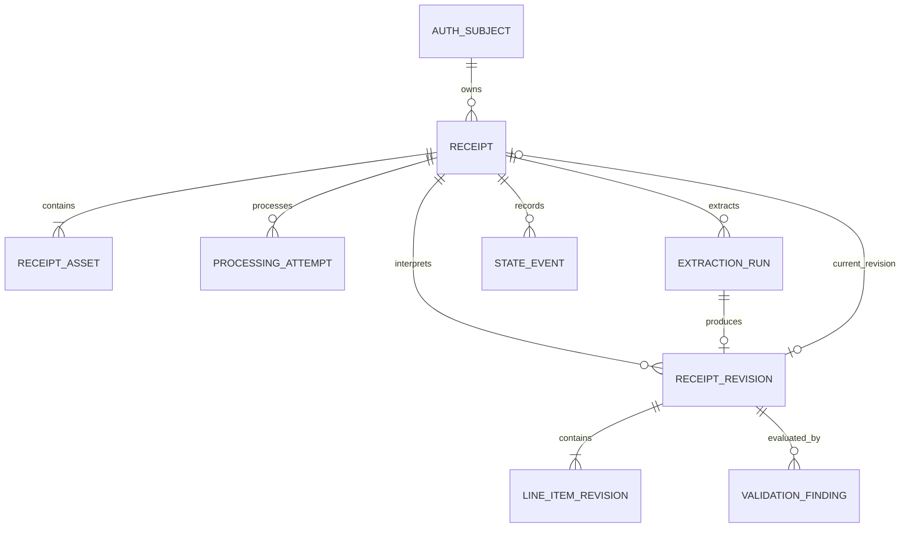
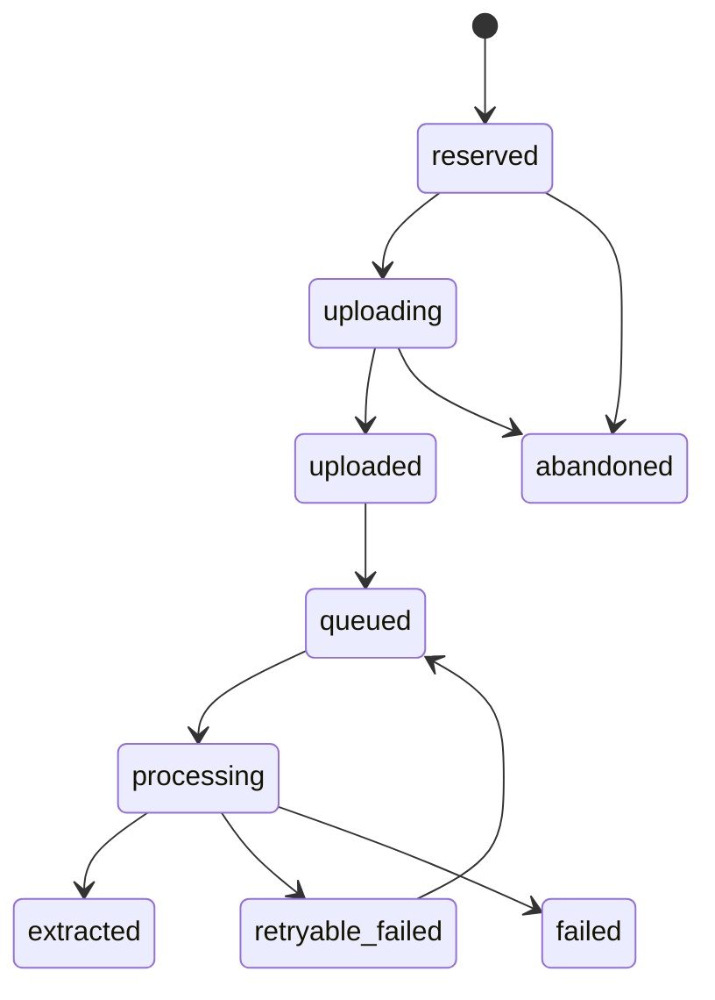
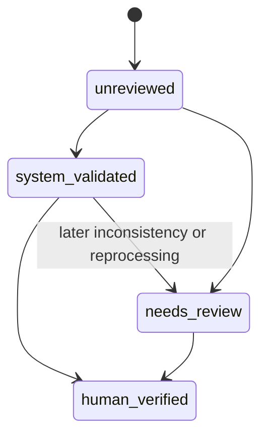

# Financial OS — Data Architecture

**Status:** Proposed Gate A review baseline  
**Scope:** Receipt acquisition with forward-compatible transaction semantics  
**Created:** August 12, 2026

## 1. Source-of-truth model

Financial OS distinguishes four forms of truth:

| Layer | Meaning | Initial authority |
|---|---|---|
| Evidence | What the source actually supplied | Original receipt image in private object storage |
| Acquisition record | How and when evidence entered the system | Financial OS PostgreSQL |
| Structured revision | A versioned interpretation of evidence | Immutable receipt revision and validation findings |
| Operational/analytical view | Current projection used for queries and interfaces | Current revision pointer and deterministic views |

Later:

- Bank/credit-card feeds provide operational transaction evidence.
- Official statements provide authoritative account-month reconciliation evidence.
- Actual Budget may become a budgeting interface or downstream projection; it is not the itemized receipt evidence store.
- A local LLM is an explanation layer and is never an authority for financial facts.

## 2. Core invariants

1. Evidence is never overwritten by normalized data.
2. An acknowledged receipt references a complete, verified evidence set.
3. Image order is stable and explicit.
4. Processing state and verification state are independent.
5. Model output is immutable provenance, not canonical fact by itself.
6. A current structured view always points to a specific immutable revision.
7. Corrections create new revisions and preserve prior values.
8. Money totals use integer minor units; quantities and high-precision unit prices use decimal types.
9. Every state transition records time, actor/source, and reason.
10. Retries do not duplicate receipts, assets, current revisions, or line items.
11. Object keys contain no merchant, date, amount, account, or other human-readable financial data.
12. Historical itemization exists only when supported by evidence.

## 3. Initial logical model



## 4. Initial tables

### 4.1 `auth_subjects`

| Field | Type/constraint | Purpose |
|---|---|---|
| `id` | UUID primary key | Internal opaque owner ID |
| `provider` | text | Identity provider |
| `provider_subject` | text unique | Stable provider UID, not display email |
| `allowlisted` | boolean | Application authorization |
| `valid_after` | timestamptz | Reject tokens authenticated earlier than this time |
| `created_at`, `updated_at` | timestamptz | Audit timestamps |

Email can be checked during bootstrap and stored only if operationally necessary. Authorization binds to stable provider UID after owner enrollment.

### 4.2 `receipts`

| Field | Type/constraint | Purpose |
|---|---|---|
| `id` | UUID primary key | Stable receipt ID |
| `owner_id` | UUID foreign key | Owner boundary |
| `client_submission_id` | UUID | Client idempotency key |
| `financial_context` | text check | `personal` initially; `rental_property` available for coarse exclusion |
| `processing_status` | text check | Internal lifecycle |
| `verification_status` | text check | Independent trust lifecycle |
| `current_revision_id` | UUID nullable foreign key | Current structured projection |
| `expected_asset_count` | integer check > 0 | Complete evidence contract |
| `captured_at` | timestamptz nullable | Client capture time when reliable |
| `acknowledged_at` | timestamptz nullable | Durable acknowledgement time |
| `row_version` | integer | Optimistic concurrency |
| `created_at`, `updated_at` | timestamptz | Audit timestamps |

Unique constraint: `(owner_id, client_submission_id)`.

### 4.3 `receipt_assets`

| Field | Type/constraint | Purpose |
|---|---|---|
| `id` | UUID primary key | Evidence asset ID |
| `receipt_id` | UUID foreign key | Parent receipt |
| `ordinal` | integer check >= 1 | Stable page/image order |
| `object_key` | text unique | Opaque private object name |
| `storage_generation` | text nullable | Immutable object generation/version |
| `declared_mime_type` | text | Client claim |
| `verified_mime_type` | text nullable | Server-observed type |
| `byte_size` | bigint nullable | Verified size |
| `sha256` | text nullable | Content integrity and duplicate signal |
| `upload_status` | text check | `reserved`, `uploaded`, `verified`, `rejected` |
| `created_at`, `verified_at` | timestamptz | Evidence timestamps |

Unique constraint: `(receipt_id, ordinal)`.

Do not cascade-delete acknowledged evidence in V1.

### 4.4 `processing_attempts`

| Field | Type/constraint | Purpose |
|---|---|---|
| `id` | UUID primary key | Attempt identity |
| `receipt_id` | UUID foreign key | Receipt processed |
| `pipeline_version` | text | Code/config version |
| `attempt_number` | integer | Ordered retry number |
| `queue_task_name` | text nullable | Safe operational reference |
| `status` | text check | `queued`, `running`, `retryable_failed`, `terminal_failed`, `succeeded` |
| `safe_error_code` | text nullable | Non-sensitive failure classification |
| `started_at`, `completed_at` | timestamptz | Latency and stuck-work measurement |

Unique constraint: `(receipt_id, pipeline_version, attempt_number)`.

### 4.5 `extraction_runs`

| Field | Type/constraint | Purpose |
|---|---|---|
| `id` | UUID primary key | Extraction identity |
| `receipt_id` | UUID foreign key | Receipt evidence interpreted |
| `processing_attempt_id` | UUID foreign key | Operational attempt |
| `provider` | text | Adapter/provider |
| `model_id` | text | Exact configured model |
| `prompt_version` | text | Versioned extraction instructions |
| `schema_version` | text | Expected structured contract |
| `asset_manifest_hash` | text | Ordered evidence identity |
| `raw_response` | JSONB nullable | Original provider structured response after transport parsing |
| `provider_request_id` | text nullable | Safe support reference |
| `status` | text check | `started`, `succeeded`, `invalid`, `failed` |
| `input_metadata` | JSONB | Non-secret sizes/counts, not image data |
| `latency_ms` | integer nullable | Performance evaluation |
| `created_at`, `completed_at` | timestamptz | Provenance timestamps |

No prompt may include credentials or unrelated financial history.

### 4.6 `receipt_revisions`

Each extraction or later human correction creates an immutable revision.

| Field | Type/constraint | Purpose |
|---|---|---|
| `id` | UUID primary key | Revision identity |
| `receipt_id` | UUID foreign key | Parent receipt |
| `parent_revision_id` | UUID nullable | Correction/revision lineage |
| `source_type` | text check | `extractor`, `human`, `import` |
| `extraction_run_id` | UUID nullable | Model provenance |
| `merchant_raw` | text nullable | Evidence-derived source text |
| `merchant_normalized` | text nullable | Suggested/corrected name |
| `purchase_datetime` | timestamptz nullable | Parsed purchase time |
| `purchase_timezone` | text nullable | Known zone; do not invent |
| `currency` | char(3) | ISO 4217 code |
| `subtotal_minor` | bigint nullable | Minor-unit subtotal |
| `tax_minor` | bigint nullable | Minor-unit tax |
| `tip_minor` | bigint nullable | Minor-unit tip |
| `discount_minor` | bigint nullable | Positive discount magnitude |
| `total_minor` | bigint nullable | Minor-unit total |
| `payment_method_hint` | text nullable | Redacted evidence hint only |
| `overall_confidence` | numeric nullable | Provider or derived score with definition |
| `created_at` | timestamptz | Revision time |

Formula convention:

```text
subtotal + tax + tip - discount ≈ total
```

### 4.7 `line_item_revisions`

| Field | Type/constraint | Purpose |
|---|---|---|
| `id` | UUID primary key | Line identity within revision |
| `receipt_revision_id` | UUID foreign key | Immutable parent revision |
| `ordinal` | integer check >= 1 | Evidence order |
| `raw_description` | text | Preserved extracted text |
| `normalized_description` | text nullable | Suggested/corrected value |
| `quantity` | numeric nullable | Exact decimal quantity |
| `unit` | text nullable | Unit of measure |
| `unit_price_decimal` | numeric nullable | Precision beyond currency minor unit when needed |
| `line_total_minor` | bigint nullable | Authoritative line total candidate |
| `discount_minor` | bigint nullable | Positive discount magnitude |
| `category_suggestion` | text nullable | Non-authoritative initial category |
| `field_confidence` | JSONB | Named per-field scores/quality signals |

Unique constraint: `(receipt_revision_id, ordinal)`.

### 4.8 `validation_findings`

| Field | Type/constraint | Purpose |
|---|---|---|
| `id` | UUID primary key | Finding identity |
| `receipt_revision_id` | UUID foreign key | Evaluated revision |
| `check_code` | text | Versioned deterministic rule |
| `outcome` | text check | `pass`, `warn`, `fail`, `not_applicable` |
| `observed` | JSONB | Non-secret observed values |
| `expected` | JSONB nullable | Rule expectation/tolerance |
| `rule_version` | text | Reproducibility |
| `created_at` | timestamptz | Evaluation time |

### 4.9 `state_events`

Append-only audit of processing and verification changes.

| Field | Type/constraint | Purpose |
|---|---|---|
| `id` | UUID primary key | Event identity |
| `receipt_id` | UUID foreign key | Aggregate |
| `dimension` | text check | `processing`, `verification`, `financial_context` |
| `from_state`, `to_state` | text nullable/text | Transition |
| `actor_type` | text | `user`, `api`, `worker`, `scheduler`, `import` |
| `reason_code` | text | Safe explanation |
| `correlation_id` | text | Trace reference |
| `created_at` | timestamptz | Event time |

## 5. State models

### 5.1 Internal processing



User-facing API may collapse `reserved`, `uploading`, `uploaded`, and `queued` into simpler language, but the database retains operational distinctions.

### 5.2 Verification



No automated process sets `human_verified`.

## 6. Transaction boundaries

### Receipt creation

Atomically create the receipt and all asset reservations. A duplicate client submission returns the existing aggregate.

### Finalization

1. Verify external object state.
2. In one database transaction, mark the verified evidence set and receipt uploaded.
3. Create an idempotent queue task.
4. Record queued/acknowledged state.

Because queue creation and PostgreSQL cannot share a transaction, retries and the reconciliation sweep repair either ordering. User acknowledgement occurs only after the complete evidence set is durable and recoverable.

### Extraction promotion

In one database transaction:

- Finish extraction run
- Insert immutable revision and line items
- Insert validation findings
- Point receipt to current revision when eligible
- Set verification and processing states
- Append state events
- Complete processing attempt

## 7. Money and time

- Store currency totals as signed or unsigned integer minor units according to field semantics.
- Receipt discount fields store positive magnitude; transaction ingestion will separately define debit/credit signs.
- Use `NUMERIC`, never binary floating point, for quantity and high-precision unit price.
- Carry ISO 4217 currency explicitly even when USD is the default.
- Store server times as UTC `timestamptz`.
- Preserve source-local date/time and timezone knowledge separately; do not invent a timezone from capture location.

## 8. Raw, normalized, and inferred data

Each field must be attributable to one category:

- **Raw evidence:** image or source-extracted literal text
- **Normalized:** cleaned merchant/product/category representation
- **Calculated:** deterministic arithmetic or aggregate
- **Inferred:** model suggestion without direct evidence
- **Corrected:** human-authored revision

APIs and analytics must not present inferred data as source fact. Current revision views carry source and verification metadata.

## 9. Duplicate strategy

Day one distinguishes:

- **Submission duplicate:** same client submission ID; prevented deterministically
- **Asset duplicate:** same content hash; signal for review, not automatic receipt merge
- **Likely receipt duplicate:** similar merchant/date/total/image hash; later heuristic
- **Cross-source duplicate:** receipt and transaction/order representing the same purchase; later matching relationship, not deletion

Never discard evidence based only on a probabilistic duplicate score.

## 10. Evolution toward transactions and matching

Sprint 3 adds source-neutral records such as:

```text
financial_accounts
transaction_imports
transactions
transaction_revisions
statements
statement_account_periods
```

Sprint 4 adds explicit relationships:

```text
purchase_evidence_links
transaction_match_candidates
confirmed_matches
reconciliation_runs
```

The matching relation supports many receipts/orders to many transactions. It never forces `receipt.transaction_id` as the sole relationship.

## 11. Personal and rental boundary

- Day-one receipts default to `personal`.
- Initial bank acquisition excludes the Ally rental account.
- Identifiable shared-card rental charges may later receive `rental_property` context and are excluded from personal behavior aggregates.
- Lowe's/Home Depot are candidate signals, not an irreversible merchant-wide rule.
- Full property/unit/tenant modeling is deferred.

## 12. Backup, export, and portability

- Enable managed PostgreSQL backups and point-in-time recovery when available in the selected tier.
- Export schema and data using standard PostgreSQL tools.
- Maintain a manifest connecting receipt IDs, asset IDs, object generation, size, and checksum.
- Back up original evidence independently of relational data.
- Test restoration into an isolated environment and verify referential/object completeness.
- Avoid database features that prevent later standard PostgreSQL deployment on the Mac Mini without explicit ADR approval.

## 13. Public-repository boundary

Never commit:

- Database files or dumps
- Receipt images
- Extracted real receipt JSON
- Statements, pay stubs, transaction exports, or logs containing financial content
- Object URLs or signed capabilities
- Provider request/response fixtures from real data

Tests use generated synthetic receipts and synthetic structured responses. Private evaluation manifests identify fixtures through opaque IDs and checksums without entering the public repository.

## 14. Deferred decisions

- Merchant and product canonical-entity tables after enough real variation exists
- Exact confidence computation and threshold calibration
- Actual Budget synchronization direction and editing authority
- Retention changes after storage/cost measurement
- Search/index design after real query patterns exist
- Local replica or migration technology for the Mac Mini
