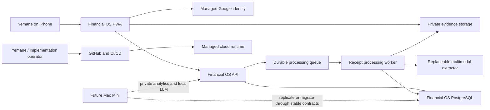
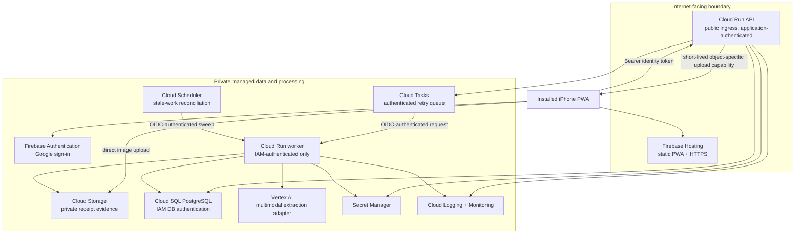
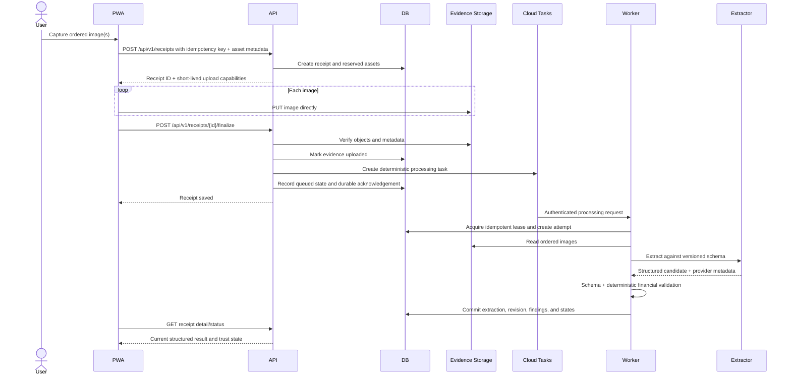

# Financial OS — System Architecture

**Status:** Proposed Gate A review baseline  
**Scope:** Sprint 0 and day-one receipt acquisition  
**Created:** August 12, 2026

## 1. Architectural objective

Ship a reliable production receipt-capture path in one focused implementation session while preserving clean boundaries for later transaction ingestion, matching, analytics, and Mac Mini services.

The design is a **portable modular monolith**:

- One canonical domain and application layer
- One PostgreSQL database
- One private evidence bucket
- One source repository
- A static PWA plus public API and private worker deployment processes
- Managed infrastructure for durability, identity, queuing, and observation

The API and worker may run as separate Cloud Run services from the same application image. This is a security and execution boundary, not independent product microservices.

## 2. System context



## 3. Deployment topology



## 4. Component responsibilities

### 4.1 PWA

- Owner sign-in and persistent device session
- Camera and photo-library acquisition
- Ordered one-or-more-image receipt draft
- Client-side preview and non-authoritative file checks
- Receipt creation, direct image upload, and idempotent finalization
- Upload progress and active-session retry
- Minimal history and detail presentation
- No extraction logic, canonical categorization, or authoritative financial calculations

### 4.2 Public API

- Verify managed identity tokens and owner allowlist
- Enforce application session invalidation and authorization
- Validate request shape, rate/size policy, and idempotency key
- Create receipt and asset reservations
- Issue short-lived, receipt-specific upload capabilities
- Verify uploaded object metadata before finalization
- Persist durable acknowledgement state
- Enqueue deterministic processing tasks
- Provide authenticated receipt history/detail and short-lived evidence retrieval
- Emit privacy-safe audit and operational events

### 4.3 Private worker

- Accept only authenticated Cloud Tasks or scheduler invocation
- Acquire an idempotent processing lease
- Verify and decode evidence without modifying the original
- Create sanitized processing derivatives, including EXIF removal
- Invoke the configured extraction provider behind an interface
- Validate schema, required fields, and financial arithmetic deterministically
- Persist extraction run, immutable revision, line items, validation findings, and state transition atomically
- Classify failures as retryable or terminal
- Never expose credentials, arbitrary tools, or write authority beyond its required data stores

### 4.4 PostgreSQL

- Canonical receipt metadata and immutable structured revisions
- State, idempotency, provenance, validation, and processing-attempt records
- No image bytes
- No connector credentials or restricted identifiers in analytical tables

### 4.5 Evidence storage

- Original receipt images under opaque object names
- Optional derived processing images separated from originals
- Uniform private access
- No automatic V1 deletion lifecycle
- Object version/generation and integrity metadata retained in PostgreSQL

### 4.6 Queue and reconciliation scheduler

- Cloud Tasks performs authenticated asynchronous delivery and controlled retries.
- A lightweight scheduled reconciliation sweep finds receipts stranded in transitional states and safely re-enqueues or marks them for attention.
- The database, not queue introspection, remains the durable source for user-visible processing status.

Google documents authenticated HTTP targets and configurable retries for Cloud Tasks, including Cloud Run targets: [creating HTTP target tasks](https://docs.cloud.google.com/tasks/docs/creating-http-target-tasks) and [retry configuration](https://docs.cloud.google.com/tasks/docs/configure-retry-task).

### 4.7 Extraction provider

The application depends on a `ReceiptExtractor` contract, not a vendor SDK in the domain layer.

```text
ReceiptExtractor.extract(
    ordered_assets,
    extraction_schema,
    prompt_version,
) -> RawExtractionResult
```

The initial adapter uses a currently available generally available Vertex AI Gemini Flash-class multimodal model selected during implementation preflight. The exact model identifier is configuration and is recorded per run. Vertex AI documents multi-image prompts and controlled JSON schema output: [multi-image input](https://docs.cloud.google.com/vertex-ai/generative-ai/docs/samples/generativeaionvertexai-gemini-single-turn-multi-image) and [predefined response schema](https://docs.cloud.google.com/vertex-ai/generative-ai/docs/samples/generativeaionvertexai-gemini-controlled-generation-response-schema-2).

## 5. Receipt submission sequence



## 6. Acknowledgement and failure semantics

### 6.1 What `Receipt saved` guarantees

Before acknowledgement:

- The receipt record exists.
- Every expected original image exists in private object storage.
- Server-side metadata validation passed.
- The receipt is eligible for deterministic re-enqueue even if the first task dispatch fails.

Acknowledgement does not claim extraction success.

### 6.2 Idempotency

- The PWA generates a random client submission ID before create.
- The database enforces one receipt per owner and client submission ID.
- Asset ordinal is unique within a receipt.
- Finalization is safe to retry.
- Queue tasks use a deterministic receipt/pipeline key when supported.
- The worker locks or conditionally updates the receipt and refuses duplicate promotion of the same pipeline revision.
- External retries can create processing attempts but not duplicate current financial facts.

### 6.3 Transitional-state recovery

The reconciliation sweep detects:

- Reserved receipts whose uploads never completed
- Uploaded receipts that were not queued
- Queued or processing receipts beyond age thresholds
- Retryable failures eligible for another attempt

It emits a metric and performs only idempotent transitions. Destructive cleanup is not part of day one.

## 7. API surface

Initial versioned endpoints:

```text
POST /api/v1/receipts
POST /api/v1/receipts/{receipt_id}/finalize
GET  /api/v1/receipts
GET  /api/v1/receipts/{receipt_id}
POST /api/v1/receipts/{receipt_id}/retry-processing
POST /api/v1/receipts/{receipt_id}/assets/{asset_id}/download

POST /internal/v1/receipts/{receipt_id}/process
POST /internal/v1/reconcile-processing
GET  /health/live
GET  /health/ready
```

The evidence download endpoint returns a short-lived capability or streams authorized content; it never makes the bucket public.

OpenAPI is generated from application schemas and checked into CI as a reviewed contract artifact.

## 8. Code architecture

Recommended repository shape:

```text
apps/
  web/                         # React/TypeScript PWA
  api/                         # FastAPI process entry point

src/financial_os/
  domain/                      # entities, values, states, invariants
  application/                 # use cases and ports
  adapters/
    auth/
    database/
    extraction/
    queue/
    storage/
    observability/
  delivery/
    http/                      # public API routes and schemas
    worker/                    # private task handlers
  config/

tests/
  unit/
  integration/
  contract/
  e2e/
  fixtures/synthetic/

infra/
  modules/
  environments/dev/

docs/
```

Dependency direction:

```text
delivery/adapters → application → domain
```

The domain has no dependency on FastAPI, Google Cloud, Firebase, SQLAlchemy, or a model SDK.

## 9. Security boundaries

- The PWA is untrusted input even after owner authentication.
- Signed upload and download capabilities are bearer secrets with narrow object scope and short lifetime.
- The public API has no extractor credential and does not execute receipt content.
- The private worker cannot be invoked anonymously.
- Original evidence and normalized structured data are separate.
- Receipt text and model output are always data, never instructions.
- GitHub deployment uses short-lived federated identity rather than service-account key files.
- Service accounts are separate for API, worker, task invocation, and deployment.

Detailed threats and controls are in `docs/security/`.

## 10. Observability

Structured events include:

- `receipt.created`
- `asset.upload_verified`
- `receipt.acknowledged`
- `processing.queued`
- `processing.started`
- `extraction.completed`
- `validation.completed`
- `processing.retry_scheduled`
- `processing.failed`
- `receipt.state_changed`

Required dimensions are opaque receipt ID, pipeline version, environment, attempt, outcome, latency, and safe error code. Logs must not contain image bytes, object capability URLs, auth tokens, raw receipt text, or model prompts/outputs.

Initial metrics:

- Acknowledged receipt count
- Acknowledgement failure count
- Processing terminal-outcome rate
- Processing latency distribution
- Job age by state
- Retry and terminal failure rate by safe error code
- Arithmetic validation outcome
- Lost-acknowledged-receipt invariant violation count

## 11. Deployment and recovery

- Build immutable containers and PWA assets in CI.
- Deploy infrastructure declaratively.
- Run database migrations as an explicit, observable deployment step, not automatically in every web instance.
- Deploy API/worker revisions before switching traffic when schema compatibility permits.
- Set conservative Cloud Run maximum instances to protect PostgreSQL connection capacity.
- Use automatic IAM database authentication through the Cloud SQL connector instead of a long-lived database password. Google recommends automatic IAM authentication and documents connector support for Python: [Cloud SQL IAM authentication](https://docs.cloud.google.com/sql/docs/postgres/iam-authentication) and [language connectors](https://docs.cloud.google.com/sql/docs/postgres/connect-connectors).
- Configure database backups and test a documented restore before calling Sprint 1 operationally complete.
- Preserve object storage and database independently; restoration verifies relational references to evidence objects.

Cloud Run scales idle revisions to zero by default, while configured maximum instances can protect backing resources such as Cloud SQL: [Cloud Run autoscaling](https://docs.cloud.google.com/run/docs/about-instance-autoscaling).

## 12. Mac Mini transition

The initial cloud system is not disposable. The transition uses stable boundaries:

- Containerized API and worker can run locally if later desired.
- PostgreSQL schema and exports remain portable.
- Storage access is behind a port; future local encrypted object storage can implement it.
- Extraction is behind a provider interface; a local model can implement it after evaluation.
- The phone PWA continues using the stable `/api/v1` contract.
- The Mac Mini can first receive a read-only replica/export for analytics before becoming authoritative for any component.
- The local LLM eventually receives only an allowlisted read-only query service, not database, connector, or storage credentials.

No migration proceeds without completeness verification, rollback, and uninterrupted acquisition.

## 13. Explicitly absent from day one

- Plaid or bank data
- Actual Budget integration
- Transaction matching
- Review/edit UI
- Product normalization memory
- General-purpose agent or chat interface
- Redis, Kubernetes, service mesh, event bus, or microservice fleet
- Public evidence storage
- Permanent service-account keys
- Automatic evidence deletion

## 14. Architecture hypotheses requiring verification

Before implementation begins:

1. Confirm the available GCP project permits Firebase Auth/Hosting, Cloud Run, Cloud SQL, Cloud Storage, Cloud Tasks, Secret Manager, Vertex AI, and Workload Identity Federation.
2. Benchmark a current generally available Vertex multimodal Flash-class model on representative synthetic and private receipt images.
3. Verify signed-upload behavior from the installed iPhone PWA, including HEIC handling and multi-image size limits.
4. Confirm the selected region supports the required services and acceptable latency.
5. Validate that the one-day implementation window can include the complete durable acknowledgement path; if not, reduce visual polish before weakening durability.
