# Financial OS — Sprint 0 and Sprint 1 Delivery Plan

**Status:** Ready for Gate A review  
**Baseline:** `planning-baseline-2026-08-12-r1`  
**Owner:** Yemane  
**Operating lead:** Codex  
**Implementation lead:** Claude Code through Vertex AI  
**Delivery target:** One focused implementation session after Gate A approval

## 1. Release outcome

At the end of the session, the owner can open an installed iPhone PWA, authenticate, photograph a one- or multi-image receipt, receive a durable saved acknowledgement, and later see either a validated structured receipt or an explicit review/failure state.

This is a private production vertical slice. It is not a prototype whose evidence can disappear after acknowledgement.

## 2. Sprint boundaries

The sprint labels describe outcome boundaries, not multi-week calendar promises.

### Sprint 0 — Production path and contracts

Create the smallest governed path from source to a deployable, observable, recoverable system:

- repository blueprint adapted to Financial OS;
- canonical project instructions and model adapters;
- application and infrastructure scaffold;
- frozen V1 OpenAPI/domain/data/state contracts;
- GCP environment and least-privilege identities;
- CI, federated deployment, configuration, secrets, database migration, backup, and observability foundation;
- synthetic fixture and test harness;
- representative extraction benchmark and pinned provider configuration.

Sprint 0 is complete only when a thin authenticated health path deploys through the real delivery pipeline and the initial migration can be applied and restored safely.

### Sprint 1 — Receipt capture vertical slice

Deliver the approved mobile workflow end to end:

- installable mobile-first PWA;
- Google/federated owner authentication;
- capture/preview/remove/retake/add image flow;
- resumable private direct uploads;
- durable, idempotent receipt finalization and acknowledgement;
- durable asynchronous task dispatch;
- multi-image extraction through a provider-neutral adapter;
- schema and deterministic arithmetic validation;
- independent processing and verification states;
- minimal recent-receipt list and detail/status;
- production monitoring, failure handling, backup/restore evidence, and real-device acceptance.

## 3. Non-goals

- Plaid or automated bank synchronization
- Receipt-to-transaction matching
- Amazon, email, Costco, statement, pay-stub, utility, or payroll adapters
- Editing or manual review workflow
- Analytics, budgets, forecasting, recommendations, chat, or a local LLM
- SwiftUI client
- Rental-property itemization
- Multi-user sharing
- Custom domain if the managed provider domain is faster
- Architectural splitting beyond the public API/private worker deployment boundary

These remain sequenced in the approved roadmap and are not forgotten.

## 4. Entry conditions

Before implementation agents modify product code:

- [ ] Gate A evidence packet is frozen and identified.
- [ ] Product/delivery, architecture/engineering, and security/production reviewers submit independent verdicts.
- [ ] All blocking and High findings are resolved or explicitly owner accepted under the governance rules.
- [ ] Implementation packet is updated to the reviewed version.
- [ ] The owner authorizes access to the selected GCP project and deployment target.
- [ ] GCP quota/API availability and selected region are validated.
- [ ] The implementation lead confirms its supervisor role and the three-agent independence/ownership protocol.

## 5. Delivery strategy

### Wave 0 — Gate A and preflight

**Objective:** prove the plan is coherent and the external platform can support it before parallel construction.

1. Run the three independent read-only reviews defined in `docs/reviews/gate-a-review-packet.md`.
2. Synthesize findings one by one; accept only evidence-backed changes.
3. Confirm GCP project, billing, region, quotas, APIs, Firebase project linkage, and GitHub repository authority.
4. Benchmark candidate current GA Vertex multimodal Flash-class models with synthetic plus a small owner-private set; record latency, schema adherence, arithmetic-field accuracy, image-format support, and cost metadata.
5. Verify iPhone Safari/PWA camera, HEIC/JPEG conversion behavior, and direct signed upload with a spike.
6. Select and record model ID, region, maximum images/bytes, upload expiry, and operational limits.

**Exit:** no known platform blocker, Gate A approval, explicit pinned runtime choices.

### Wave 1 — Contract and production spine

**Objective:** remove shared-file ambiguity before parallel work.

The Claude supervisor owns this wave and freezes:

- repository layout and project instructions;
- OpenAPI V1 endpoints and schemas;
- domain value types and processing/verification transitions;
- extraction input/output schema;
- initial database migration and invariants;
- object-key and task-payload contracts;
- configuration schema and environment names;
- test naming/evidence layout;
- infrastructure outputs consumed by applications.

Implement a thin authenticated vertical path:

```text
PWA sign-in → API owner authorization → database connectivity → health/version evidence → CI deploy
```

**Exit:** contracts compile/validate, initial migration passes, CI builds both applications, dev deployment is reachable only as designed.

### Wave 2 — Three bounded parallel builds

After Wave 1 is committed/frozen, the Claude supervisor may launch up to three normal Sonnet agents with independent bounded ownership.

| Workstream | Primary ownership | Deliverable | Must not independently change |
|---|---|---|---|
| A — Mobile PWA | `apps/web/`, web tests, PWA assets | Installed camera-first flow, upload orchestration, statuses/history/detail, accessibility | OpenAPI/domain/storage contracts, infrastructure |
| B — Receipt service | `apps/api/`, `src/financial_os/`, migrations, server tests | Authenticated API, storage/queue/database adapters, worker, extraction/validation, recovery | Accepted product scope, web UI, cloud topology |
| C — Platform and verification | `infra/`, `.github/`, build/deploy scripts, synthetic E2E harness, runbooks | GCP resources/IAM, WIF CI/CD, headers/config, backup/restore, alerts, deploy/E2E evidence | Domain/API contracts, product behavior |

Rules:

- Agents receive the same frozen packet and their exact file boundaries.
- No agent sees another agent's review or substitutes an assumption for a frozen contract.
- Contract changes are proposed to the supervisor; only the supervisor integrates them.
- Real financial evidence never enters an agent prompt, repository, CI artifact, or public log.
- Each agent returns tests and acceptance evidence, not only code.

### Wave 3 — Integration and failure proof

The supervisor integrates in dependency order:

1. migration and managed-service adapters;
2. public API and signed object transfer;
3. queue-authenticated worker and extractor;
4. PWA capture/status workflow;
5. observability, reconciliation, backup, and deployment checks.

Run the complete deterministic suite plus failure injection:

- concurrent duplicate receipt create;
- partial/missing/invalid/expired upload;
- failure between object verification, DB transition, and task creation;
- duplicate task delivery and provider timeout;
- schema-valid arithmetic inconsistency;
- prompt-injection and stored-XSS receipt fixtures;
- unauthorized owner, object, and worker calls;
- stale work and explicit retry/terminal behavior;
- restore to isolated target and object/DB inventory comparison.

**Exit:** every day-one requirement has pass/fail evidence; no silent unresolved state.

### Wave 4 — Gate B, deployment, and real-device acceptance

1. Freeze the release candidate by commit and immutable image digest.
2. Launch three fresh independent read-only reviews in parallel:
   - product/UX and scope conformance;
   - code/data/architecture and reliability;
   - security/production/control verification.
3. Resolve blocking/High findings and rerun affected checks.
4. Deploy by federated CI identity; apply migration as an explicit step.
5. Complete acceptance on the owner's actual iPhone using a non-sensitive synthetic/test receipt first.
6. Verify acknowledgement, processing result, failure visibility, close/reopen session, Wi-Fi/cellular behavior, and receipt retrieval.
7. Authorize private production use only after the release checklist passes.

**Exit:** Gate C accepted by owner with evidence recorded.

## 6. Critical path

```mermaid
flowchart LR
    G["Gate A"] --> P["GCP and iPhone preflight"]
    P --> C["Freeze contracts"]
    C --> W["Thin deployed spine"]
    W --> A["Three parallel builds"]
    A --> I["Integration and failure tests"]
    I --> B["Gate B reviews"]
    B --> D["Production deploy"]
    D --> U["Owner iPhone acceptance"]
```



The highest schedule risks are administrative cloud access, signed upload behavior on the real iPhone, Cloud SQL provisioning/migration, and model output/schema quality. Wave 0 attacks those risks first.

## 7. Acceptance and definition of done

Sprint 0/1 is done only when all of the following are true:

### Product

- Installed PWA completes the approved capture flow on the owner's iPhone.
- A normal single-image receipt reaches durable acknowledgement within ten seconds under documented Wi-Fi and cellular test conditions, excluding extraction.
- One multi-image receipt preserves order from capture through evidence retrieval and extraction.
- History/detail show truthful current processing and verification state.

### Data and AI

- Every saved receipt has durable relational metadata and private original evidence.
- Model output is versioned, provenance-bearing, schema validated, and deterministically checked.
- Duplicate create/task execution produces one logical current result.
- No result is silently repaired or treated as human verified.

### Reliability and operations

- Zero acknowledged receipts are lost in the acceptance and failure-injection suite.
- At least 95% of the release fixture set reaches a terminal processing outcome in two minutes.
- Stuck work is measurable and safely retryable.
- Backup/PITR configuration and an isolated restore smoke test are recorded.
- Deployment can be reproduced from source and immutable artifacts.

### Security and privacy

- Every applicable `MUST` control in `docs/security/control-baseline.md` has evidence.
- Non-owner, anonymous-object, direct-worker, prompt-injection, stored-XSS, and log-content tests pass.
- CI and repository contain no secrets or real private financial data.
- Runtime access can be revoked.

### Portfolio quality

- Public documentation and synthetic demo explain product outcome, tradeoffs, architecture, threat model, testing, and measured results.
- All private production values, screenshots, evidence, identifiers, and environment details remain excluded from public artifacts.
- Known limitations and next slice are recorded honestly.

## 8. One-day scope control

If time pressure appears, remove work only in this order:

1. animations and nonessential visual polish;
2. rich history/detail presentation beyond the approved minimum;
3. optional image enhancement beyond safe decode/orientation;
4. reusable infrastructure abstraction and local convenience tooling;
5. polished manual retry controls, while preserving explicit failure state and an operator retry path.

Do not cut owner authorization, private storage, durable acknowledgement, PostgreSQL metadata, queue durability, explicit states, validation, provenance, critical-path tests, or recovery evidence.

If GCP permissions block the approved design, stop and amend the execution packet to the already-evaluated managed fallback. Do not improvise public upload, unauthenticated access, in-memory state, or local-only evidence after acknowledgement.

## 9. Rollback and fallback

- PWA: redeploy the prior immutable hosting release.
- API/worker: route to the prior compatible Cloud Run revision.
- Migration: use expand/contract compatibility; destructive downgrade is not the normal rollback path.
- Processing: pause queue dispatch, retain evidence, and reconcile later.
- Extractor: disable new processing or pin the prior provider configuration; capture remains available when safe.
- Full service failure: preserve private images/metadata and accept manual photo-library capture until service restoration; do not claim unsent photos were saved.

## 10. Next planned slices

After production observation stabilizes receipt capture:

1. Sprint 2 — evaluation set, review/edit workflow, operational hardening, and data-quality calibration.
2. Sprint 3 — Capital One Venture X and Ally personal transaction acquisition from January 1, 2026, manual export first and Plaid evaluated/added.
3. Sprint 4 — receipt/transaction candidate matching and statement reconciliation; coarse rental exclusion.
4. Sprint 5+ — Amazon, Costco, email, recurring bills, statements, payroll, behavior analysis, and eventually local Mac Mini intelligence.

The next sprint begins from observed capture data and operational evidence, not from assumed completeness.
