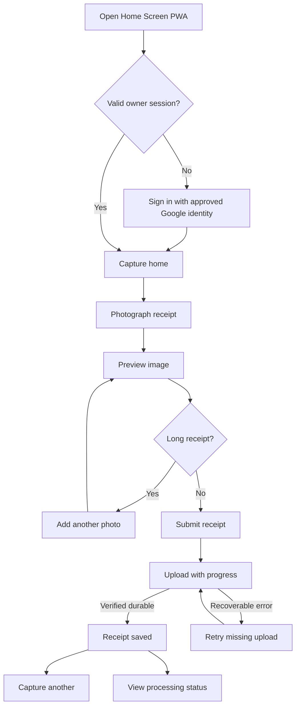

# Financial OS — Day-One Receipt Capture UX

**Status:** Proposed review baseline  
**Scope:** Installable mobile-first PWA  
**Primary device:** Yemane's iPhone  
**Created:** August 12, 2026

## 1. Experience goal

The normal workflow should feel like a receipt shutter button:

```text
Open → photograph → submit → saved
```

The user should not categorize, correct, or wait for extraction during capture. The system earns trust by acknowledging only durable evidence, showing unambiguous status, and never losing an acknowledged receipt.

## 2. Experience principles

1. **Camera first:** The primary action is visible immediately.
2. **One photo by default:** Long-receipt controls stay secondary.
3. **Durability before celebration:** Show “Saved” only after server verification and durable acknowledgement.
4. **Processing is asynchronous:** The user may capture the next receipt while extraction continues.
5. **Failure preserves work:** A network or partial-upload failure offers retry without forcing a new photograph during the current session.
6. **Status uses words and icons:** Never communicate success or failure by color alone.
7. **No financial judgment:** Capture screens do not show spending advice or moralizing messages.

## 3. Primary user flow



## 4. Screens and states

### 4.1 Authentication

Shown only without a valid owner session.

**Content:**

- Financial OS name and privacy statement
- `Continue with Google` primary action
- Clear error if the authenticated identity is not allowlisted

**Rules:**

- No public registration.
- No password field.
- Successful authentication returns to the intended capture route.

### 4.2 Capture home

**Primary content:**

- Large `Photograph receipt` button
- Camera/receipt icon
- Small `Choose existing photo` fallback
- Secondary `Recent receipts` link

**Behavior:**

- On supported iPhones, request the environment-facing camera through an image file input.
- If camera access is denied or unavailable, the user can select from the photo library.
- No dashboard, budget, category, or analytics content appears on this screen.

### 4.3 Receipt draft

**Content:**

- Ordered image thumbnails labeled `1`, `2`, and so forth
- Current image preview
- `Retake` or `Replace`
- `Remove`
- `Add another photo` secondary action
- `Submit receipt` primary action

**Rules:**

- Preserve the photographed images in the active session until durable acknowledgement or explicit discard.
- Submission is disabled while no valid image remains.
- The UI explains that additional images should overlap slightly and follow receipt order.
- Client-side checks reject unsupported types and clearly excessive files before upload, while the server remains authoritative.

### 4.4 Upload progress

**Content:**

- Overall progress and per-image completion when useful
- `Uploading 2 of 3` or equivalent text
- Prevent accidental double submission

**Rules:**

- Upload images directly to private object storage using short-lived object-specific authorization.
- Retry only incomplete images after a transient failure.
- Do not call the receipt saved until server finalization verifies the evidence set.

### 4.5 Saved acknowledgement

**Content:**

- `Receipt saved`
- Receipt identifier or short reference
- `Processing in the background`
- `Capture another` primary action
- `View receipt` secondary action

**Timing:**

- This screen is the end of the measured capture workflow.
- Extraction may continue for up to the accepted processing target.

### 4.6 Recent receipts

Minimal list ordered newest first.

Each row may show:

- Capture time
- Merchant and total when available, otherwise `Processing receipt`
- Processing status
- Verification status
- Image count

This is not an analytics dashboard.

### 4.7 Receipt detail

**Content:**

- Ordered receipt images behind authenticated retrieval
- Processing and verification status
- Merchant, date, totals, and line items when extracted
- Validation summary
- Failure reason expressed safely and a retry-processing action when appropriate
- Extraction provenance summary without exposing prompts, credentials, or sensitive logs

The initial detail view can prioritize readable structured data over polished editing controls.

## 5. Failure behavior

| Condition | User experience | System behavior |
|---|---|---|
| Camera permission denied | Offer photo-library selection and concise settings guidance | Record no financial content |
| Unsupported file | Identify the specific image and accepted formats | Do not request an upload authorization |
| Image too large | Offer client compression/retry guidance | Enforce server limit as final authority |
| Network lost before acknowledgement | Keep current-session draft and show `Retry upload` | Do not create a false saved state |
| One of several images fails | Mark only that image incomplete | Preserve completed private objects and accept idempotent retry |
| Finalization fails after upload | Show `Finishing save—retry` | Retry idempotently; do not duplicate receipt |
| Extraction provider fails | Show receipt as saved with `Processing failed` later | Preserve evidence; retain failure; permit safe retry |
| Invalid model output | Show `Needs review` or `Processing failed` | Quarantine invalid output; do not promote it to a current revision |
| Session revoked | Return to sign-in and preserve only safe local draft state | Reject private API operations immediately at application boundary |

Full persistent offline queuing is Sprint 2. Day one requires clear retry within the active experience and never claims an unacknowledged receipt is saved.

## 6. Performance measurement

The ten-second target covers:

```text
Home screen visible
→ camera interaction
→ one image accepted
→ user taps submit
→ durable acknowledgement visible
```

Because camera interaction and cellular upload vary, record:

- Device and iOS version
- Network type
- Image dimensions and bytes
- Time to preview
- Upload duration
- Finalization duration
- Total workflow duration

Report median and p95 rather than only a best-case demonstration.

## 7. Accessibility baseline

- Minimum 44×44 CSS-pixel touch targets where practical
- Programmatic labels for every control and image position
- Visible keyboard focus and logical focus order
- Sufficient text/background contrast
- Status announced to assistive technology through appropriate live regions
- Errors linked to the affected control
- No gesture-only required action
- No color-only processing or verification state
- Respect reduced-motion preference
- Safe-area-aware layout for iPhone Home Screen mode

## 8. PWA implementation notes

- Include a Web App Manifest, stable app identifier, icons, start URL, theme colors, and standalone display configuration.
- Serve exclusively over HTTPS.
- Use HTML Media Capture for the most reliable minimal camera path rather than making live `getUserMedia` a day-one dependency.
- Use a service worker for the application shell, but do not cache authenticated receipt responses or images in a broadly accessible cache.
- Keep authentication and API behavior functional when opened from the installed Home Screen context.

WebKit documents both Home Screen web-app behavior and image capture through file inputs: [Safari Home Screen web apps](https://webkit.org/blog/17333/webkit-features-in-safari-26-0/) and [HTML Media Capture](https://webkit.org/blog/7477/new-web-features-in-safari-10-1/).

## 9. Day-one UX acceptance demonstration

On the target iPhone:

1. Add the application to the Home Screen.
2. Authenticate with the allowlisted identity.
3. Close and reopen without repeating authentication.
4. Capture and submit a normal one-image receipt over Wi-Fi.
5. Capture and submit a long multi-image receipt over cellular data.
6. Interrupt one upload and recover without duplicating the receipt.
7. Confirm acknowledged evidence is retrievable.
8. Observe extracted or explicit failure/review status within the accepted time.
9. Deny camera permission and successfully use the photo-library fallback.
10. Confirm the primary workflow meets the documented accessibility and timing checks.
