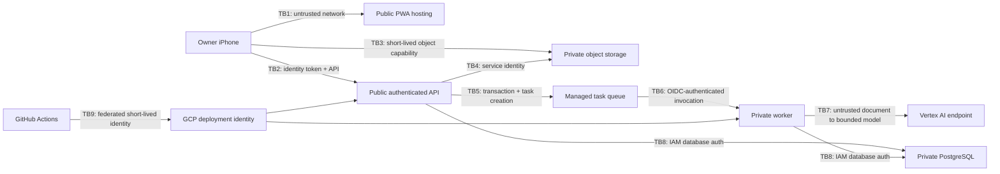

# Financial OS — Day-One Threat Model

**Status:** Proposed Gate A review baseline  
**Baseline:** `planning-baseline-2026-08-12-r1`  
**Scope:** Personal receipt-capture vertical slice and its delivery pipeline  
**Method:** Asset- and trust-boundary analysis informed by STRIDE

## 1. Security objective

Make it safe to capture private financial evidence quickly from an iPhone without weakening the core product guarantees:

1. only the owner can access the system;
2. an acknowledged receipt is not lost or silently corrupted;
3. hostile receipt content cannot control the application or AI runtime;
4. credentials and restricted identifiers are not exposed;
5. security failures are detectable, containable, and recoverable.

Security does not mean eliminating cloud processing. The owner has accepted reputable managed cloud storage and processing for private financial content. Security does mean preventing public exposure, unauthorized access, unsafe AI authority, and accidental inclusion of private data in development artifacts.

## 2. Scope and assumptions

### In scope

- installed mobile-first PWA;
- Firebase Authentication and owner allowlist;
- public Cloud Run API;
- private Cloud Run worker;
- private Cloud Storage receipt objects;
- Cloud SQL PostgreSQL structured records;
- Cloud Tasks dispatch;
- Vertex AI receipt extraction;
- Secret Manager, logging, monitoring, backups, CI/CD, and infrastructure configuration;
- future export path needed for Mac Mini portability.

### Out of scope for day one

- Plaid and bank credentials;
- email and Amazon account access;
- payments or movement of money;
- multi-user sharing;
- rental-property itemization;
- general-purpose local-agent tools;
- a public portfolio dataset containing real financial evidence.

### Accepted assumptions

- The application is single-owner in V1.
- Google identity is an accepted identity provider; the application also enforces its own immutable owner allowlist.
- Managed-service encryption at rest is sufficient initially; customer-managed encryption keys are not a day-one requirement.
- Original images are retained indefinitely in V1 and must therefore remain recoverable and access controlled.
- The exact generally available extraction model is selected after a representative benchmark and pinned in configuration.

## 3. Assets and classification

| Asset | Classification | Security need |
|---|---|---|
| Auth tokens, signing credentials, API secrets, deploy identity | Restricted | Never log or commit; least privilege; revoke quickly |
| SSN, full date of birth, account credentials, government IDs | Restricted | Do not intentionally ingest in V1; detect/minimize before durable analytical storage when later sources can contain them |
| Receipt images and raw receipt text | Private financial | Owner-only access, private storage, durable backup, no public test fixtures |
| Normalized receipt and line-item records | Private financial | Owner-only access, integrity, provenance, exportability |
| Processing metadata and security audit events | Private operational | Integrity, useful retention, privacy-safe content |
| Schema, prompts, source code, synthetic fixtures | Public-development eligible | Secret/private-data scanning before publication |
| Service configuration and infrastructure state | Sensitive operational | Change control, least privilege, recoverability |

## 4. Security actors

- **Owner:** legitimate user on a managed or personal iPhone and development workstation.
- **Unauthenticated internet actor:** probes public application and API endpoints.
- **Session thief:** possesses a stolen device, browser session, or bearer token.
- **Malicious uploader:** attempts oversized, malformed, polyglot, repeated, or unauthorized uploads.
- **Hostile document author:** embeds instruction-like text, HTML, URLs, or misleading arithmetic in receipt evidence.
- **Compromised dependency or CI actor:** tries to alter code, workflow, artifact, or deployment identity.
- **Accidental operator:** creates public access, logs data, grants broad IAM, or deploys an unsafe configuration.
- **Provider or service failure:** causes delay, duplication, partial writes, corrupted responses, or regional unavailability.
- **Future overly capable AI agent:** attempts to use data or tools outside its read-only analytical authority.

## 5. Trust boundaries

The most important boundary is conceptual: model input and output cross an untrusted-data boundary. Model output does not become authoritative merely because it is valid JSON.

## 6. Risk rating

Likelihood and impact are rated `Low`, `Medium`, or `High` for the initial single-user system. Residual risk assumes the listed controls are implemented and verified.

| ID | Threat and failure mode | L | I | Required mitigation | Residual |
|---|---|---:|---:|---|---|
| T-01 | An authenticated but non-owner Google identity reaches private functions. | M | H | Verify Firebase token server-side; compare immutable subject/email to server-side allowlist on every private request; default deny. | L |
| T-02 | A stolen phone or bearer token retains application access. | M | H | Short token lifetime from provider; persistent session with server-side owner session version/revocation; revoke provider sessions; no sensitive offline cache. | M |
| T-03 | A signed upload or read URL leaks, is replayed, or targets another object. | M | H | Short expiry; random server-selected object names; bind method/content constraints; verify object ownership and metadata at finalize; never log URLs. | L |
| T-04 | Malformed, huge, excessive, or deceptive files cause cost or availability harm. | M | M | Count and byte limits; MIME allowlist plus decoded-image inspection; request throttling; max Cloud Run instances; bounded model input; reject before queueing. | L |
| T-05 | Bucket, object, database, or service becomes publicly accessible. | L | H | Public-access prevention; uniform bucket access; no public database IP unless explicitly justified; authenticated services; infrastructure policy and negative tests. | L |
| T-06 | Receipt text performs prompt injection or induces tool use/data exfiltration. | H | H | Treat content as data; narrow extraction-only prompt; no tools, browsing, secrets, or arbitrary URLs in extractor; structured response schema; adversarial fixtures. | L |
| T-07 | Hallucinated or manipulated output silently changes financial facts. | H | H | Schema validation, deterministic arithmetic, confidence/provenance, independent verification state, no silent repair, visible needs-review state. | M |
| T-08 | Retry, race, or double tap creates duplicate receipts or divergent current results. | H | M | Client submission key; database uniqueness; transactional state changes; idempotent task/run keys; append-only revisions; optimistic/version checks. | L |
| T-09 | An actor directly invokes, replays, or forges a worker task. | M | H | Private ingress; Cloud Tasks OIDC token with exact audience; dedicated invoker identity; verify expected task metadata; idempotent processing. | L |
| T-10 | Logs, errors, traces, analytics, or crash reports expose tokens, URLs, images, or receipt content. | M | H | Structured allowlist logging; centralized redaction; production error envelopes; log snapshot tests; no third-party session replay. | L |
| T-11 | Overprivileged services or compromised SQL access exposes or mutates all data. | M | H | Separate runtime/deploy identities; IAM database authentication; least-privilege database roles; no shared owner credential; backups and audit events. | M |
| T-12 | Deletion, deployment defect, provider outage, or corruption loses acknowledged evidence or records. | M | H | Durable-before-ack finalization; object versioning/retention protection as selected; automated SQL backups/PITR; restore drill; export; reconciliation of DB and object inventory. | L |
| T-13 | CI compromise or long-lived cloud key enables malicious deployment. | M | H | Workload Identity Federation/OIDC; no service-account keys; protected default branch; pinned or trusted actions; minimal deploy role; artifact provenance. | M |
| T-14 | A vulnerable or malicious application dependency compromises browser or server. | M | H | Lockfiles; automated dependency and static scanning; minimal dependency set; prompt patching of exploitable production issues; CSP and safe rendering. | M |
| T-15 | Automated abuse or processing loop produces uncontrolled cloud charges. | M | M | Auth before expensive work; per-owner throttles; file limits; retry ceilings; dead-letter/terminal failure; billing budget alerts; max instances. | L |
| T-16 | A later pay stub or statement persists restricted identifiers in raw or analytical form. | M | H | Source-specific intake gate; detect and redact/minimize restricted fields before normalized persistence; quarantine ambiguity; never include them in logs or public fixtures. | M |
| T-17 | Extracted receipt text creates stored XSS or unsafe link execution in the PWA. | M | H | Render text through framework escaping; never inject raw HTML; do not make model-produced URLs active; restrictive CSP; security test fixture. | L |
| T-18 | CORS, CSRF-like behavior, or confused-deputy requests misuse an authenticated browser. | M | M | Authorization header tokens, narrow CORS origin, no state-changing GET, content-type enforcement, same-site hosting preference, owner checks. | L |
| T-19 | Partial failure strands objects, states, or queue work without visibility. | H | M | Explicit state events; finalize transaction; stale-work reconciler; age metrics; safe retry endpoint; orphan inventory job. | L |
| T-20 | Accidental infrastructure or IAM changes weaken controls outside code review. | M | H | Declarative infrastructure; least privilege; audit logs; environment separation where practical; post-deploy policy checks; break-glass procedure. | M |

## 7. Misuse cases that must be tested

1. Sign in with a valid Google account that is not the allowlisted owner.
2. Reuse an expired signed URL or use a signed URL for a different object or method.
3. Upload a file whose extension, declared MIME type, and decoded content disagree.
4. Submit the same receipt key concurrently and execute the same queue task twice.
5. Directly invoke the worker without the expected Cloud Tasks identity/audience.
6. Use receipt text that says to ignore instructions, expose secrets, browse a URL, or return invented totals.
7. Return schema-valid but arithmetically inconsistent model output.
8. Store receipt descriptions containing script tags, HTML attributes, or dangerous URLs and render the result.
9. Force model timeout, database failure, and queue retry after evidence has been acknowledged.
10. Inspect logs and error responses after every case for private or restricted content.

## 8. Control strategy by boundary

### Identity and public API

- Trust only server-verified identity tokens.
- Authorize the owner in application code on every private API operation.
- Rate limit or reject expensive work before storage/AI calls.
- Validate request schemas and use uniform privacy-safe errors.

### Direct object transfer

- The API chooses object identity; the client never supplies an arbitrary bucket path.
- Signed capabilities are short-lived and single-purpose.
- Finalization distrusts client claims and verifies the stored objects.
- Reading evidence requires a newly authorized request and short-lived capability.

### Queue and worker

- Only a dedicated queue identity may invoke the private worker.
- Every processing attempt has an idempotency key and bounded retries.
- Terminal and retryable failures are explicit and observable.

### AI extraction

- The model has no tools or credentials.
- System instructions define extraction, not decision authority.
- Inputs are bounded images; document instructions are data.
- Output must satisfy a versioned schema and deterministic validation before publication.

### Data and operations

- Database and bucket remain non-public and least privileged.
- Append-only provenance explains every current result.
- Backups, export, and restore are tested—not merely configured.
- Logs use an approved-field allowlist.

### Delivery pipeline

- CI uses short-lived federated identity.
- Real financial content is never a repository or CI fixture.
- Required checks include tests, static analysis, dependency review, secret scanning, private-data scanning, migration validation, and infrastructure checks.

## 9. Residual risks and accepted tradeoffs

- A device with an active session remains a meaningful risk until access is revoked. This is accepted for capture speed; the mitigation is rapid server-side invalidation and no private offline cache.
- A reputable AI provider processes private financial images. This is accepted for the initial managed-cloud deployment; provider use remains replaceable and is recorded per run.
- Default managed-service encryption is accepted initially. Customer-managed keys would increase operational cost without materially improving the current single-owner threat posture.
- Cloud SQL creates more initial setup than an embedded database but is accepted for transaction integrity, backups, and later acquisition/matching work.
- Permanent V1 evidence retention increases breach impact. It is accepted to protect provenance; access, inventory, export, and later policy review are mandatory.

## 10. Explicitly rejected day-one security theater

The following are not day-one requirements unless an independent reviewer demonstrates a concrete blocking threat:

- microservice proliferation;
- custom authentication or password storage;
- a security operations platform requiring full-time administration;
- customer-managed encryption keys;
- a separate secrets vault outside managed Secret Manager;
- broad content inspection that transmits data to additional vendors;
- a WAF as a substitute for application authorization and limits;
- manual approval for every low-risk deployment.

These may become appropriate as users, integrations, authority, or exposure expand.

## 11. Threat-model maintenance triggers

Review and version this threat model before introducing any of the following:

- Plaid or another financial-account credential/token;
- Gmail, Amazon, payroll, or statement ingestion;
- a second user or sharing;
- Mac Mini inbound network exposure or synchronization;
- a local/general AI agent with tools;
- edits that become authoritative financial facts;
- payment initiation;
- public APIs, browser automation, or externally supplied webhooks.

## 12. Gate A security questions

1. Does a credible High-impact threat lack a release-blocking control?
2. Can an authenticated non-owner reach any private data or expensive operation?
3. Can receipt content or model output cross from data into executable instructions, HTML, URLs, queries, or tools?
4. Is any acknowledged-evidence loss mode still possible without detection and recovery?
5. Does any required control add complexity without reducing a current threat?
6. Which residual risk should be explicitly accepted, rejected, or time-boxed?
